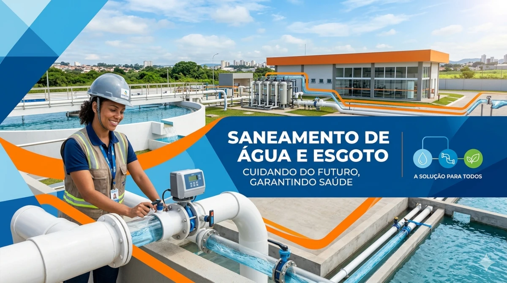

# SaneWeb

Projeto pessoal de desenvolvimento de uma sistema de catálogo de materiais padronizados para redes de água e esgoto.

## Problematização

1. Uma variedade muito grande de materiais hidráulicos de dimensões diferentes dificultam a identificação rápida para manutenção do material adequado;
2. Dificuldade de comunicação devido ao tratamento popular que o profissional dá ao material e a nomenclatura do sistema, que geram confusão para aquisição ou requisição dos materiais, causando entrega equivocada, trocas e atraso na manutenção;
3. Falta de clareza na aplicação dos materiais de acordo com suas características para solucionar problemas específicos;
4. Curva de aprendizado lenta para profissionais do setor administrativo devido a falta de experiência com os materiais;
5. Dificuldade para no planejamento de compras para identificar a modalidade e o fornecedor correto de cada material.

## Proposta

Criação de um site na internet e/ou intranet com informações públicas, que não estejam restritas pela LGPD, que permitam:

1. Qualquer player, agente de manutenção, almoxarife, comprador, solicitante, ter referencia de imagem do material;
2. Padronizar códigos de identificação, nomenclaturas e descrições a fim de eliminar redundâncias no cadastro e mitigar equívocos entre materiais parecidos;
3. Consulta rápida da modalidade de compra e do fornecedor do item agilizando processos de compra;
4. Centralizar informações para reduzir a dependência de planilhas ou immpressos;
5. Ser um ponto de partida para a cultura de desenvolvimento de aplicações customizadas às demandas reais de trabalho
